# 🔐 NETWORKWALKS-B083F-WK4-MEDIROZA-PENETRATION-TESTING

### Mediroza General Hospital — Authorized Black-Box Penetration Testing & Vulnerability Assessment


## 📌 Project Overview

This repository documents my Week 4 penetration testing project completed as part of the NetworkWalks Cybersecurity & Ethical Hacking Internship Programme — Batch B083F.

The project involved an authorized black-box penetration test and vulnerability assessment of a simulated healthcare environment belonging to Mediroza General Hospital.

The engagement was conducted within a controlled educational environment with written authorization. The objective was to assess the target from an external attacker's perspective, identify exposed attack surfaces, demonstrate the real-world impact of confirmed weaknesses, and document the findings professionally.

## 🎯 Project Objectives

### M1 — Initial Access
Identify exposed attack surfaces and weaknesses in the target web application and demonstrate authorized access to the restricted area containing three confidential patient PDF laboratory reports.

### M2 — PDF Password Recovery
Analyze the encryption applied to the three retrieved PDF files and use appropriate password-recovery techniques and tools to recover access to the authorized test files.

### M3 — Sensitive Data Exposure
Investigate the environment for additional confidential information and identify exposure of employee salary information and hospital shareholder information.

### M4 — Professional Penetration Testing Report
Document the engagement, methodology, findings, evidence, risk ratings, impact and remediation recommendations in a professional penetration-testing report.

## 🎯 Target

**Mediroza General Hospital**

**Target:** https://medirozahospital.com

**Testing Type:** Black-box Penetration Testing

**Engagement Duration:** 5 Days

**Authorization:** Written authorization granted for the NetworkWalks educational exercise.

## ⚠️ Ethical & Confidentiality Notice

All activities documented in this repository were performed only against the authorized target within the controlled NetworkWalks educational environment.

No techniques described here should be applied to systems, applications, networks, accounts, or data without explicit authorization from the system owner.

Because this project involved a simulated healthcare environment and confidential information, this public repository intentionally does not contain:

- Patient names or medical information
- Original patient PDF reports
- Recovered PDF contents
- Session cookies or session IDs
- Employee names or personally identifiable information
- Employee salaries
- Shareholder identities or confidential ownership details
- Database dumps containing confidential records
- Credentials or authentication tokens
- Unredacted screenshots containing sensitive information

Evidence included in this repository has been sanitized for educational and portfolio purposes.

## 🧭 Scope

### In Scope

- https://medirozahospital.com
- Publicly accessible web resources
- Web application attack surface
- Authentication mechanisms
- Exposed directories and files
- Authorized vulnerability validation
- Authorized retrieval and analysis of project-provided PDF files
- Authorized password-recovery testing
- Analysis of publicly exposed database backup material
- Documentation of security findings

### Out of Scope

The project rules prohibited:

- Social engineering
- Denial-of-Service attacks
- Testing systems outside the authorized target
- Unapproved attacks against third-party infrastructure
- Destructive activity

## 🛠️ Tools Used

| Tool | Purpose |
| --- | --- |
| **Kali Linux** | Primary security-testing environment |
| **WHOIS** | Domain registration reconnaissance |
| **NSLookup** | DNS resolution and IP identification |
| **cURL** | HTTP/HTTPS response and header analysis |
| **WhatWeb** | Web technology fingerprinting |
| **WAFW00F** | Web Application Firewall detection |
| **DNSRecon** | DNS infrastructure enumeration |
| **Nmap** | Port, service and version enumeration |
| **Gobuster** | Directory and file enumeration |
| **Browser / HTTP tools** | Manual validation of discovered web resources |
| **NetworkWalks Hash Calculator** | Authorized password/hash recovery testing |
| **NetworkWalks Password Cracker** | Authorized password recovery testing |
| **pdf2john** | PDF hash extraction for password-recovery testing |
| **John the Ripper** | Attempted PDF password recovery |
| **pdfcrack** | Alternative PDF password-recovery testing |
| **qpdf** | PDF encryption verification and authorized decryption |
| **ExifTool / PDFInfo** | PDF metadata and document-property analysis |

## 🔎 Methodology

The assessment followed a structured penetration-testing workflow:

```
Reconnaissance
      ↓
Attack Surface Enumeration
      ↓
Web Resource Discovery
      ↓
Authentication & Input Analysis
      ↓
Authorized Access Validation
      ↓
PDF Encryption Analysis
      ↓
Password Recovery Testing
      ↓
Sensitive Data Exposure Analysis
      ↓
Risk Assessment
      ↓
Remediation Recommendations
      ↓
Professional Reporting
```

The assessment focused on demonstrating security impact rather than simply identifying technologies or open services.

## 📋 Milestones Completed

| Milestone | Activity | Status |
| --- | --- | --- |
| **M1** | Initial access and retrieval of three authorized PDF laboratory reports | ✅ Completed |
| **M2** | Password recovery and decryption testing of all three PDFs | ✅ Completed |
| **M3** | Identification of sensitive employee and shareholder data exposure | ✅ Completed |
| **M4** | Professional penetration-testing report | ✅ Completed |

## 🔐 M1 — Initial Access & Web Application Assessment

The first phase focused on understanding the external attack surface of the target.

Reconnaissance and enumeration activities identified information relating to:

- Domain registration
- DNS infrastructure
- Web server technologies
- Network services
- HTTP/HTTPS behavior
- Exposed directories
- Application endpoints
- Authentication pages
- Historical resources
- Backup files

Directory enumeration identified several interesting resources, including areas associated with:

`/staff/`  
`/patient/`  
`/old/`

Further validation identified accessible application resources within these directories.

The assessment subsequently demonstrated an authorized exploitation path that allowed access to the restricted patient-report functionality, resulting in the retrieval of three encrypted PDF laboratory reports as required by the project milestone.

### Evidence

Sanitized screenshots are available under:

### Patient Portal Login
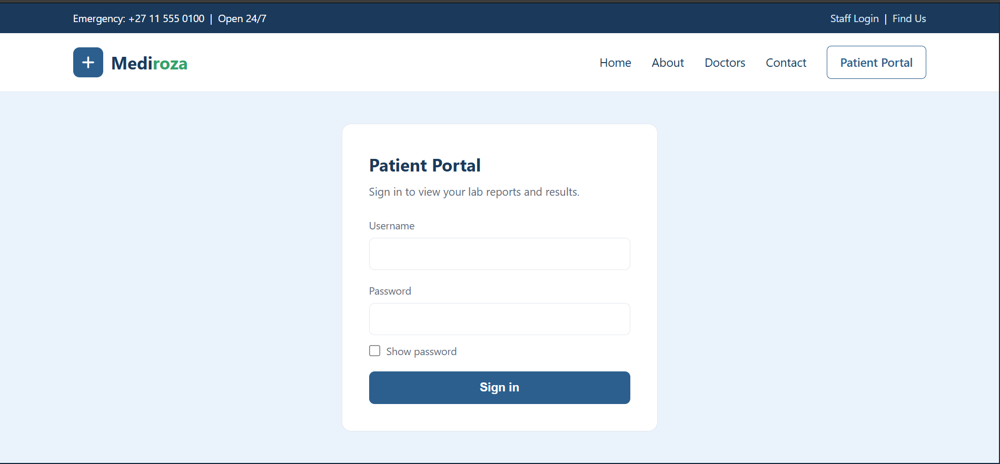

### Successful Access to Lab Reports
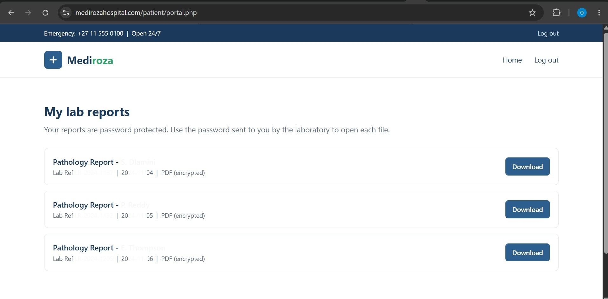

### Directory Enumeration
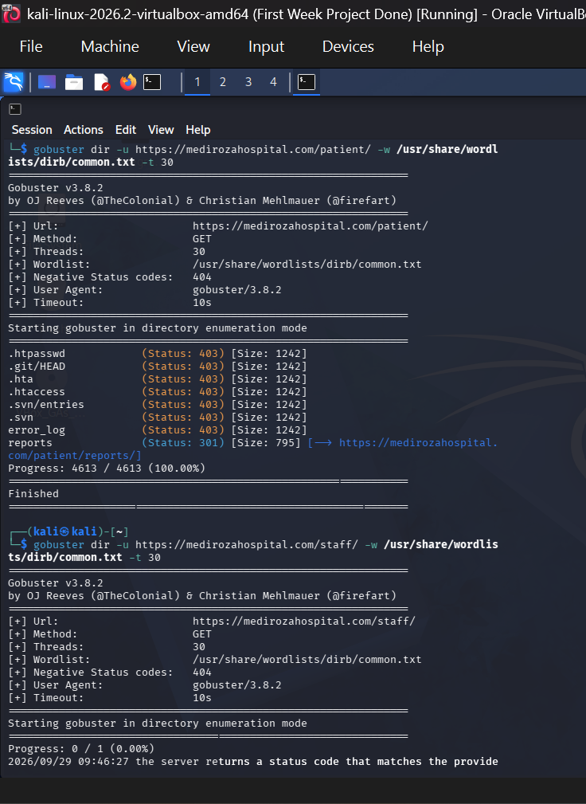

### Source Code Revealing Login Paths
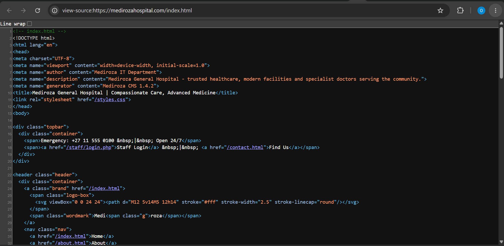

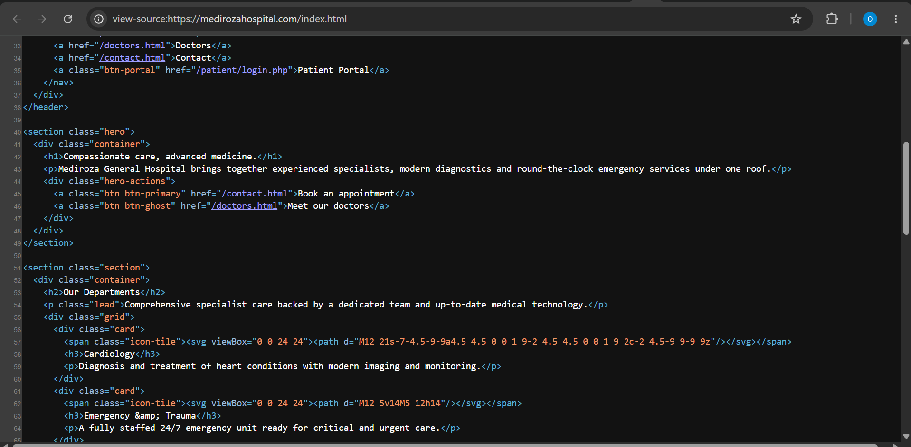

Sensitive patient information has been excluded from this public repository.

## 🔑 M2 — PDF Password Recovery

The three retrieved PDF files were encrypted and required password recovery before their contents could be accessed.

The encryption properties were first analyzed to determine the appropriate recovery approach.

### Recovery Approach

Multiple tools were evaluated rather than assuming that a single password-recovery method would work for all three files.

```
PDF Encryption Analysis
        ↓
Hash Extraction / Password-Recovery Preparation
        ↓
NetworkWalks Password-Recovery Tools
        ↓
John the Ripper Attempt
        ↓
Alternative Recovery with pdfcrack
        ↓
qpdf Decryption
        ↓
Encryption Verification
```

### Cross-Tool Results

The NetworkWalks Hash Calculator / Password Cracker successfully recovered access to two of the three authorized PDF files.

The third PDF was not successfully recovered using the NetworkWalks tools, so an alternative authorized recovery method was used.

pdfcrack successfully recovered access to the remaining PDF.

All three recovered files were subsequently decrypted using qpdf, and their encryption status was verified.

### John the Ripper

An attempt was also made to use pdf2john and John the Ripper.

The extracted PDF hash format was not accepted by the installed John the Ripper PDF format, so this approach was not successful for the engagement.

This demonstrated the importance of having alternative recovery techniques available during penetration testing.

### Security Observation

The ability to recover passwords for all three encrypted PDF reports using password-recovery techniques demonstrates that encryption alone does not provide sufficient protection when weak or guessable passwords are used.

### Evidence

Sanitized evidence is available under:

### NetworkWalks Password Cracker – Report 1
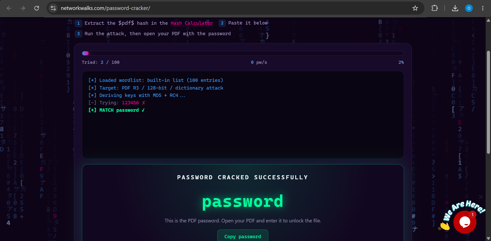

### NetworkWalks Password Cracker – Report 2
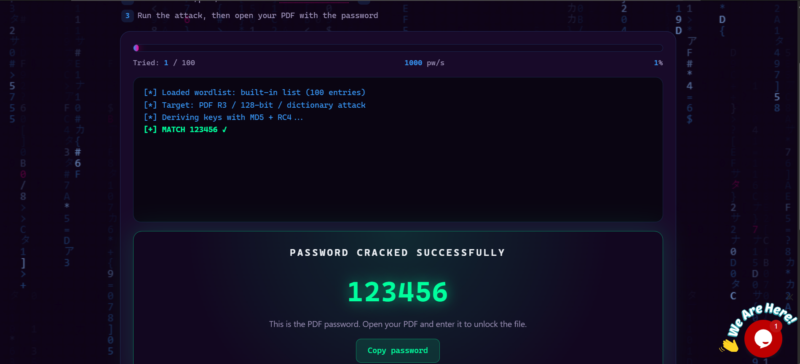

### pdfcrack Success – Report 3
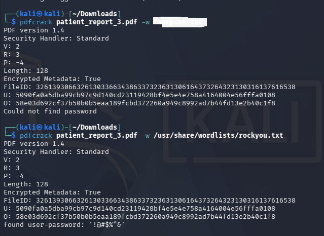

### Decrypted Report 1
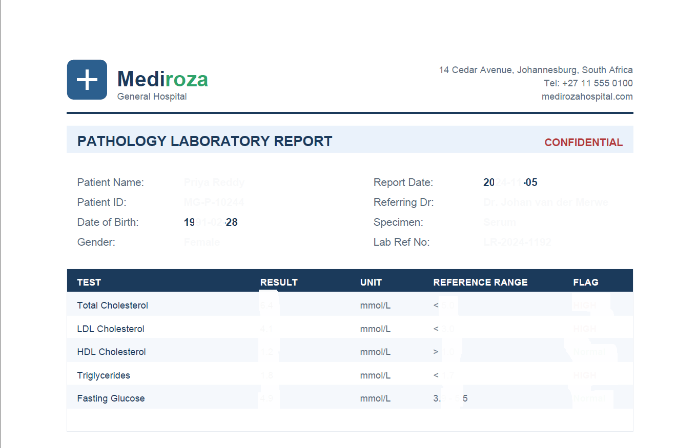

### Decrypted Report 2
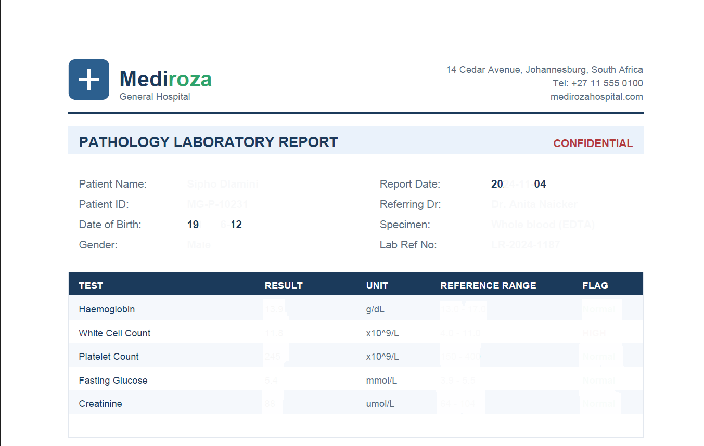

### Decrypted Report 3
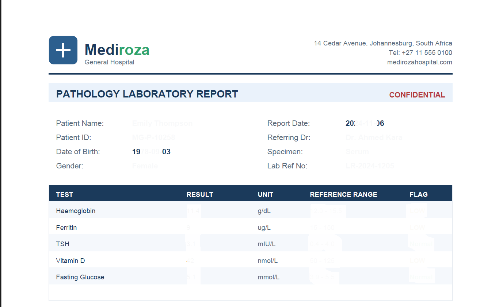

> Patient names, medical information, and sensitive PDF contents are intentionally excluded.

## 🗄️ M3 — Sensitive Data Exposure

During further investigation of the target environment, a publicly accessible historical database backup was identified.

The exposed resource was located under the historical `/old/` directory.

The database backup contained database structures associated with confidential organizational information, including tables relating to:

### Staff

The database structure contained fields associated with:

- Employee identity
- Job title
- Department
- Email
- Telephone information
- National identification information
- Monthly salary
- Date joined

### Shareholders

The database structure also contained fields associated with:

- Shareholder identity
- Share percentage
- Shares held
- Share class

This represented a significant information-disclosure risk because the backup was accessible through the web server without the protection expected for confidential database material.

### Security Impact

An exposed database backup can provide an attacker with structured information that may support:

- Privacy violations
- Identity-related attacks
- Social engineering
- Credential attacks
- Business intelligence gathering
- Further application compromise
- Targeted attacks against employees or stakeholders

### Evidence

Sanitized evidence is available under:

### Exposed Database Backup Directory
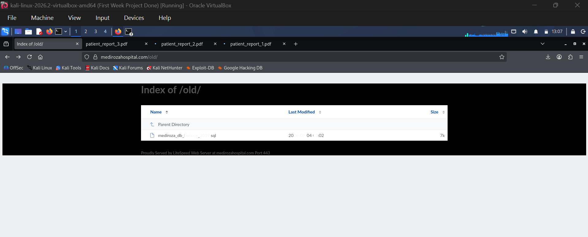

### Staff Salaries in Database Dump
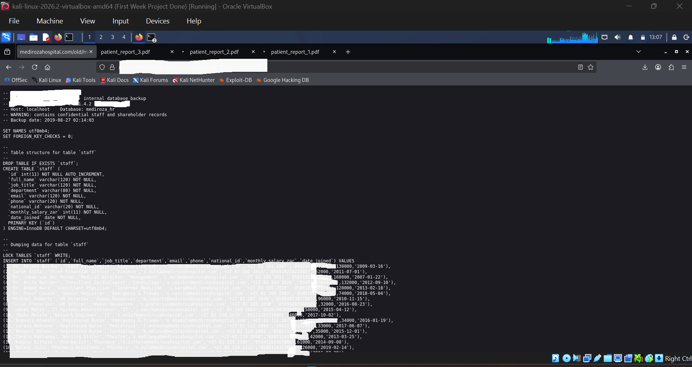

### Shareholder Details in Database Dump
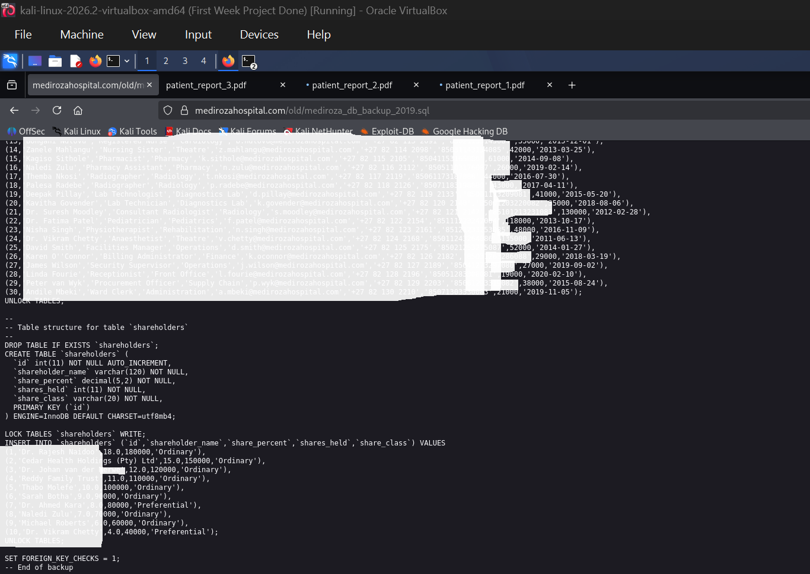

The original database backup is not included in this public repository.

## 🚨 Key Findings

| ID | Finding | Severity |
| --- | --- | --- |
| **F-01** | Authentication/Input weakness leading to unauthorized access to restricted application functionality | **Critical** |
| **F-02** | Publicly accessible directory indexing exposing application resources | **High** |
| **F-03** | Publicly accessible database backup containing confidential records | **High** |
| **F-04** | Weak PDF passwords allowing password recovery | **High** |
| **OBS-01** | Externally reachable services and technology information | **Low–Medium Observation** |

Severity ratings represent the assessment performed during this controlled educational engagement and are based on observed exposure and demonstrated impact.

## 🧪 Technical Findings

### F-01 — Authentication/Input Weakness

**Severity:** Critical

#### Summary

Testing identified a weakness in the application's handling of user input/authentication functionality that enabled authorized testing to reach a restricted area of the application.

#### Impact

Successful exploitation demonstrated that an attacker could bypass the intended access controls and reach restricted resources.

#### Recommendation

- Implement parameterized queries/prepared statements.
- Validate and sanitize all user-supplied input.
- Apply server-side input validation.
- Implement secure authentication and authorization controls.
- Use least-privilege database accounts.
- Implement secure error handling.
- Conduct regular secure-code reviews and penetration testing.

### F-02 — Public Directory Indexing

**Severity:** High

#### Summary

Directory indexing was observed on several web paths, exposing the names and locations of application resources.

Examples included:

`/staff/`  
`/patient/`  
`/old/`

#### Impact

Directory indexing can disclose:

- Application files
- Login endpoints
- Historical resources
- Backup files
- Internal application structure

This information can significantly assist further reconnaissance.

#### Recommendation

- Disable directory listing/indexing.
- Remove unnecessary files from the web root.
- Restrict access to administrative and internal directories.
- Apply appropriate web-server access controls.
- Review historical directories and archived resources.

### F-03 — Publicly Accessible Database Backup

**Severity:** High

#### Summary

A historical SQL database backup was accessible through the web server.

The backup contained database structures associated with confidential staff and shareholder information.

#### Impact

Exposure of a database backup can result in significant confidentiality and privacy risks.

#### Recommendation

- Remove database backups from the public web root.
- Store backups outside the web-accessible directory.
- Apply strict filesystem permissions.
- Disable directory indexing.
- Encrypt sensitive backups.
- Implement secure backup-management procedures.
- Search for additional exposed backups and configuration files.
- Rotate potentially exposed credentials where applicable.
- Monitor web-accessible directories for unauthorized files.

### F-04 — Weak PDF Password Protection

**Severity:** High

#### Summary

All three authorized PDF laboratory reports were protected by passwords that could be recovered through password-recovery techniques.

#### Impact

Weak passwords can undermine otherwise functional document encryption.

An attacker who obtains an encrypted document may be able to recover its password using dictionary or brute-force techniques, depending on password complexity and available resources.

#### Recommendation

- Use long, random passwords for sensitive documents.
- Avoid dictionary words and predictable passwords.
- Use unique passwords for each sensitive document.
- Consider centrally managed encryption solutions for sensitive healthcare information.
- Implement appropriate access-control mechanisms instead of relying solely on document passwords.
- Establish secure document-handling policies.

### 👀 OBS-01 — Externally Reachable Services & Technology Information

**Severity:** Low–Medium Observation

Network enumeration identified several externally reachable services and technology information.

Observed services included web, DNS, email and file-transfer related services.

Technology and service information should not automatically be treated as a vulnerability. However, unnecessary exposed services can increase the external attack surface.

#### Recommendation

- Review all Internet-facing services.
- Disable services that are not required.
- Keep exposed software updated.
- Restrict administrative services where possible.
- Apply firewall and network-access controls.
- Monitor exposed services continuously.

## 🛡️ Overall Recommendations

Based on the assessment, Mediroza General Hospital should prioritize the following security improvements:

1. **Secure application input handling** — Implement secure coding practices, parameterized queries and robust server-side validation.
2. **Strengthen authentication and authorization** — Ensure that users cannot access restricted resources without appropriate authorization.
3. **Disable directory indexing** — Directory listing should not be enabled on sensitive application directories.
4. **Remove sensitive files from the web root** — Database backups, historical files, logs and internal documents should be stored outside publicly accessible directories.
5. **Strengthen document encryption** — Sensitive documents should use strong, unique and unpredictable passwords or centrally managed encryption.
6. **Review exposed services** — Conduct periodic external attack-surface assessments and remove unnecessary Internet-facing services.
7. **Protect confidential healthcare information** — Patient, employee and shareholder information should be protected through appropriate access controls, encryption and secure data-handling procedures.
8. **Implement continuous security testing** — Regular vulnerability assessments and penetration tests should be performed to identify weaknesses before attackers discover them.

## 📄 Final Penetration Testing Report

The complete professional penetration-testing report is available in:

`M4-Final-Report/`

The report contains:

- Executive Summary
- Scope and Methodology
- Tools Used
- Reconnaissance and Attack Surface Analysis
- Findings and Proof of Exploitation
- Risk Ratings
- Milestone Results
- Recommendations and Remediation
- Evidence Handling
- Technical Evidence Appendix
- Conclusion

## 📁 Repository Structure

```
NETWORKWALKS-B083F-WK4-MEDIROZA-PENETRATION-TESTING/
├── README.md
├── M1-Initial-Access/
│   ├── README.md
│   └── screenshots/
├── M2-PDF-Password-Recovery/
│   ├── README.md
│   └── screenshots/
├── M3-Data-Exposure/
│   ├── README.md
│   └── screenshots/
├── M4-Final-Report/
│   └── W4-M4-Mediroza-General-Hospital-Penetration-Testing-Report-Oluwatobiloba-Banjo-FINAL.docx
└── screenshots/
    └── sanitized-evidence/
```

## 🔒 Public Evidence Handling

This repository is intentionally sanitized.

The following materials remain private and are not committed to GitHub:

❌ Patient PDF files  
❌ Patient medical information  
❌ Recovered PDF contents  
❌ Database dump  
❌ Employee personal information  
❌ Employee salary records  
❌ Shareholder identities  
❌ Shareholder ownership information  
❌ Credentials  
❌ Authentication tokens  
❌ Session cookies or session IDs  
❌ Unredacted screenshots

## 📚 Key Learning Outcomes

This project provided practical experience across several areas of cybersecurity, including:

- Black-box penetration testing
- Web reconnaissance
- Attack-surface enumeration
- DNS reconnaissance
- Web technology fingerprinting
- Directory enumeration
- Authentication assessment
- Input-validation assessment
- Vulnerability validation
- Password-recovery techniques
- PDF encryption analysis
- Database exposure analysis
- Sensitive-data identification
- Risk assessment
- Security remediation
- Technical documentation
- Evidence management

A particularly important lesson from the engagement was the value of method flexibility. When one password-recovery approach failed, alternative tools were evaluated and used within the authorized scope rather than assuming that one tool would work for every target.

## 📈 Project Status

| Component | Status |
| --- | --- |
| Reconnaissance | ✅ Complete |
| Attack Surface Enumeration | ✅ Complete |
| M1 — Initial Access | ✅ Complete |
| M2 — PDF Password Recovery | ✅ Complete |
| M3 — Sensitive Data Exposure | ✅ Complete |
| M4 — Professional Report | ✅ Complete |
| Evidence Sanitization | ✅ Complete |
| GitHub Documentation | ✅ In Progress |

## 👨‍💻 Author

**Banjo Oluwatobiloba Adekunle**

**ISC² Certified in Cybersecurity (CC) | CompTIA Security+**

Cybersecurity Trainee & Team Lead — NetworkWalks Technologies  
NetworkWalks Cybersecurity & Ethical Hacking Internship  
**Batch B083F**

🔗 **LinkedIn:** https://www.linkedin.com/in/oluwatobiloba-banjo-b2368819b/

💻 **GitHub:** https://github.com/oluwatobilobacybers-lang

### Areas of Practical Interest

- Cybersecurity
- Security Operations
- Vulnerability Assessment
- Penetration Testing
- Network Security
- Risk Assessment
- GRC
- Incident Response
- Digital Forensics

> **Progress over perfection.**

## ⚖️ Disclaimer

This repository is intended strictly for educational, portfolio and professional development purposes.

All security testing documented here was conducted against an authorized target within the NetworkWalks controlled educational environment.

Never perform penetration testing, vulnerability scanning, password recovery, exploitation or other security testing against systems without explicit authorization.

**Project:** NetworkWalks Batch B083F — Week 4  
**Client/Target:** Mediroza General Hospital  
**Assessment Type:** Authorized Black-Box Penetration Testing  
**Status:** Completed
